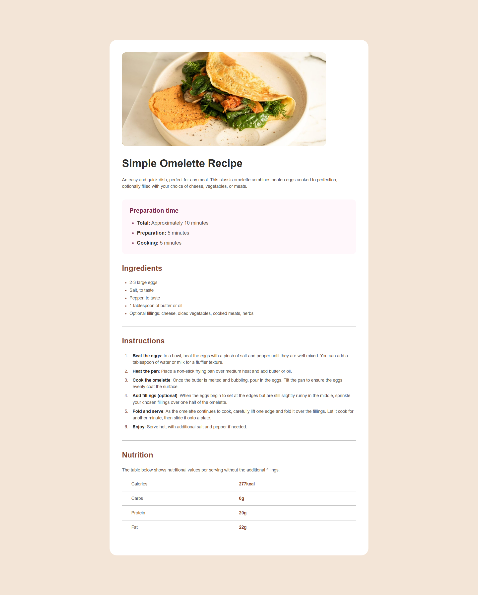

# 🍽️ Página de recetas

Esta es una solución al [desafío de página de recetas en Frontend Mentor](https://www.frontendmentor.io/challenges/recipe-page-KiTsR8QQKm). Los desafíos de Frontend Mentor te ayudan a mejorar tus habilidades de programación creando proyectos realistas.

## 🔎 Descripción general

### 📷 Captura de pantalla

### 🔗 Links
- [URL de la solución](https://www.frontendmentor.io/solutions/pgina-de-recetas-que-utiliza-html-y-css-DC34hcutYL)
- [URL del sitio en vivo](https://braismarquez2025.github.io/recipe-page-main/)

## 💡 Mi proceso

### 🔧 Llevado a cabo con

- HTML
- SCSS

### 📈 Lo que aprendí
Con este proyecto he desarrollado mis habilidades con flexbox y sobre todo, con grid, ya que la parte final titulada "Nutrición" ha sido la parte que más me ha costado y más tiempo me ha llevado. También me ha servido para darme cuenta de que es mejor utilizar una arquitectura sass ya que queda un código mucho más organizado y limpio que en un solo archivo css.

### ✌️ Autor 
- 💼 GitHub - https://github.com/braismarquez2025
- ✉️ Gmail - braismarquez2003@gmail.com
- 👤 Usuario de Frontend - [@braismarquez2025](https://www.frontendmentor.io/profile/braismarquez2025)

